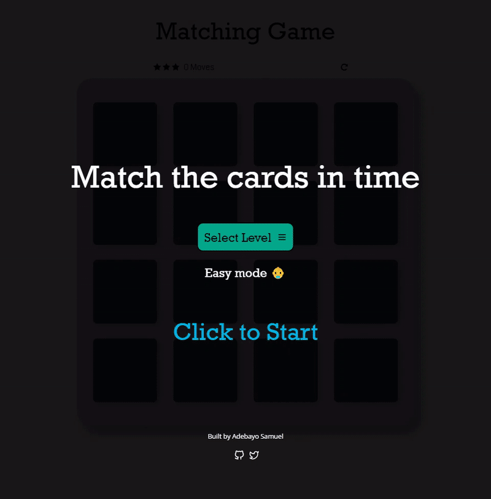

# Memory Game Project

## Table of Contents

* [Instructions](#instructions)
* [Contributing](#contributing)

## Instructions

A very simple game really. match the icons as shown in the gif within thw time frame for the selected level.

To get started, visit https://adebayo-s.github.io/card-memory-game/ and start playing

For specific, detailed instructions, look at the project instructions in the [Udacity Classroom](https://classroom.udacity.com/me).

## Contributing

If you find a bug or you want to contribute, you can fork the repo and make a pull request. 😁
